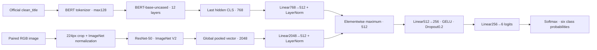

# Full text + image: two-part completion plan

**Plan ID: `MM-COMPLETE-v1` · 9 October 2026 · PROPOSED, awaiting the user's go.**

Work only in `/Users/panveenaidu/Downloads/SEM7/UROP`. This session reviewed evidence and saved a plan. It did not train, acquire the large image archive, change the dataset or start a cloud session.

**Recommendation: Part 1 adds 20 percentage points (40% → 60%); Part 2 adds 40 (60% → 100%).** These are workflow checkpoints for the first full-cohort, single-seed multimodal baseline. They are not accuracy, elapsed time, a promise of completion today, or completion of the entire research project. Repeated seeds, image-only training and advanced comparisons remain separately tracked.

## 1. What is confirmed

| Item | Evidence-grounded state |
|---|---|
| Text-only | BERT-base seed42 complete: six training/validation epochs, epoch 4 selected by validation Macro-F1, full test and archives verified. Validation accuracy **82.7407%**, Macro-F1 **77.8682%**; test **82.3901%**, **77.4566%**. Preserve this result. |
| Full text+image | **40%**: split/schema audit and pilot-demonstrated implementation exist. No full-cohort multimodal training, validation or final test exists. |
| Engineering pilot | BERT-base + **ResNet-50**, maximum fusion; 2,000/300/300 rows; three epochs; validation accuracy79.33%, test74.33%. This is a completed engineering check, not a full benchmark. Do not rerun it or use it as proof of a paper win. |
| Image coverage | Fresh count: **75,995** local images, matching the preserved manifest and official split/title/label records. This is **11.13%** of 682,661 rows; **606,666 images remain unverified/unavailable locally**. The existing `images.zip` contains the same 75,995 real images, plus Mac metadata, not the missing full collection. |
| Modern models | ModernBERT is prepared but untrained; CLIP, SigLIP 2 and advanced fusion have no project results. ResNet-55 was a naming mistake; the implementation uses ResNet-50. |
| GitHub | Local and remote `main` both matched `d0f7d7e5c440958f819c2811a199dc3bbfeccb88` before this planning update. Historical notes sometimes say “pending”; the latest completion receipt supersedes them. |

Evidence: [text final report](../results/TEXT_ONLY_FINAL_REPORT_20261009.md), [progress tracker](../results/PROGRESS_TRACKER.json), [pilot result](../results/experiments/multimodal/MM-PILOT-6W-v1_seed42_20261009/result.json), [new audit and file inventory](../results/MULTIMODAL_PLAN_AUDIT_20261009.json).

The review covered current context, decisions, experiment/task/cloud logs, model status, README, source/configs, manifests and numerical receipts, plus the 23-page literature survey. All three official TSVs were rescanned and hashes rechecked. Image filenames, nonzero sizes and ZIP membership were inspected; this was not a fresh decode of every image or every large tensor. `Branch · UROP` and recent turns of `Implement and run E002 baseline` were accessible. A separate conversation named `UROP` was not listed; saved context is the primary record. The audit distinguishes reference inventory from detailed review.

## 2. Dataset and target

Use only the released public multimodal cohort in the [faculty dataset](https://drive.google.com/drive/folders/1DuH0YaEox08ZwzZDpRMOaFpMCeRyxiEF):

| File | Role | Rows |
|---|---|---:|
| `multimodal_train.tsv` | Learn model weights | 564,000 |
| `multimodal_validate.tsv` | Select checkpoints and assess planned changes | 59,342 |
| `multimodal_test_public.tsv` | Final evaluation after selection is frozen | 59,319 |

Local originals: `data/official_multimodal_v2/`. Expected hashes and Drive file IDs: [provenance](../results/official_dataset_provenance.json). The three files were visibly reconfirmed in Chrome. Use `clean_title` + the image belonging to the same `id`, with the released `6_way_label`. No new random split, balancing, synthetic replacements, author/subreddit/domain inputs, extra labels or private test data.

Classes: **0 True; 1 Satire/Parody; 2 Misleading Content; 3 Imposter Content; 4 False Connection; 5 Manipulated Content.** Binary and three-way experiments are outside these two parts. If requested later, use the released label columns; three-way labels cannot safely be invented by merging the six classes.

| Matching six-way text+image comparator | Validation accuracy | Test accuracy |
|---|---:|---:|
| Original paper, BERT + ResNet-50 maximum fusion | 86.00% | 85.88% |
| Desired **+2 percentage points** | 88.00% | 87.88% |
| Desired **+3 percentage points** | 89.00% | 88.88% |

Source: [original paper, Tables4–5](https://arxiv.org/html/1911.03854v2). These are aspirations, not predicted scores. The paper's binary values and text-only row are different tasks. Its feature-extraction pipeline differs from our proposed fine-tuning, and its 682,996 multimodal count differs from the release by 335 rows; the cause remains unresolved. Report numerical comparisons with those caveats, not exact reproduction or state-of-the-art claims. It does not provide matching macro/weighted-F1, balanced accuracy or loss; mark them **not reported**. Table6 gives class error rates, not class F1.

## 3. First gate: full image availability

The [dataset authors](https://github.com/entitize/Fakeddit#download-image-data) recommend [public_images.tar.bz2](https://drive.google.com/file/d/1cjY6HsHaSZuLVHywIxD5xQqng33J5S2b/view). Its preview was accessible, but too large to display; the Details panel failed. **Archive size, checksum, contents and complete ID coverage are not yet verified.** No download was started.

Part1 begins with a bounded feasibility check, using CPU storage/preparation before allocating a GPU:

1. Inspect actual archive size/access, cloud scratch space, private input capacity, retained-output limits and transfer speed. Local free space was about 120 GB at review; do not assume it fits compressed plus extracted images. The current subset's 8.4 GB suggests roughly 75 GB of raw images if representative, an estimate only.
2. Prefer the author archive. Build an ID-indexed inventory and extract only required official IDs, preserving original bytes. Stream/decompress into bounded shards where capacity permits; record source, bytes, hashes, shard index and resumable preparation state. Verify the storage route before committing to a long transfer. Avoid downloading hundreds of thousands of stale URLs as the first approach.
3. Decode every required image, convert to RGB at model input, and join one image to each TSV ID. Record missing/corrupt/duplicate images and counts by split and class; audit duplicate content across splits without silently moving/removing rows. Reuse existing images only with recorded provenance and a mismatch check where official bytes differ.
4. Save `data/official_paired_v1/paired_manifest.csv`, per-image/shard hashes and `results/official_image_coverage_v1.json`. Keep originals untouched. Require **564,000/59,342/59,319 usable pairs** before calling the run a full released-cohort benchmark.
5. Save verified private cloud input versions, then verify hashes inside the training runtime. Keep large image inputs out of retained training outputs. Allow space for two recovery generations, selected weights, predictions and metadata.

**If full coverage or storage cannot be secured:** save the missing-ID/failure inventory and a concrete storage/access blocker. Continue independent code/recovery checks, but do not launch a mislabeled full run or inflate progress. A reduced paired cohort needs a separately named protocol and an explicit scope decision, with matched text/image/multimodal training cohorts. Merely filtering existing full-text test predictions would not make differently trained cohorts a controlled comparison. The historical75,995 subset remains historical.

## 4. Model and actual architecture

The first full run reuses the verified pilot architecture, with a documented text warm start:



Train both encoders and fusion head end to end with cross-entropy on logits. Initialize the BERT encoder from the completed **validation-selected epoch 4** weights, whose hash is `870bea50fa608dddd20421c21fd1786e244b1323e22734093214b87023666753`. Map only matching encoder tensors; explicitly exclude the old classifier/pooler and verify every expected tensor. Use fresh ResNet ImageNet V2 weights, projections/head, optimizer and scheduler. This is transfer initialization, not resuming the old text optimizer or the pilot. Count the prior BERT training cost in the research report. If mapping verification fails, repair it; do not silently substitute different weights.

Architecture code already demonstrated: [pilot trainer](../scripts/train_multimodal_pilot.py). That file is hardcoded to a pilot; create a new full-cohort trainer/config, preserving the pilot source and artifacts.

### Proposed fixed protocol for the first full run

| Setting | Proposed value |
|---|---|
| New protocol | `OFFICIAL-6W-MM-v1`, seed42, one initial result |
| Budget | **Maximum4 epochs**, validation after each; Part1 finishes epochs 1–2, Part2 epochs 3–4 unless legitimate early stopping applies |
| Why4 | Resource-bounded first full run using a trained text encoder; the pilot measured200.52s for its three training passes, validations and test. Linear scaling suggests about 21 GPU hours for four full epochs. Four is a planning cap, not a claim of convergence. |
| Input / batch | Max128 tokens, dynamic padding; microbatch8 × accumulation4 = effective32; evaluation batch32 |
| Optimizer | AdamW; BERT lr1e-5, ResNet lr1e-4, head lr1e-3; decay .01 text/head and .0001 image; no decay for bias/normalization; betas(.9,.999), eps1e-8; clip1.0 |
| Schedule |10% warm-up then linear decay over the complete4-epoch planned update budget; keep unchanged across the two parts; scheduler advances only on successful AMP optimizer updates |
| Precision | CUDA fp16 AMP with scaler; record skipped updates and nonfinite failures |
| Images | Pilot preprocessing: train RGB RandomResizedCrop224, scale(.8,1), ratio(.75,4/3), bilinear/antialias; eval Resize232 + CenterCrop224; ImageNet mean/std; no flips or colour changes |
| Selection | Highest full-validation Macro-F1; ties lower loss, then earlier epoch. Report the accuracy of that SAME selected checkpoint. |
| Early stopping | Evaluate every epoch; after at least 3 epochs, stop after 2 consecutive epochs without Macro-F1 improvement ≥.001. Record the exact rule and counter. |
| Test | Freeze selected weight/config hashes first. One final test of that selected run. No target-driven test tuning. |

These are **proposed settings**, replacing neither `BP-6W-v1` nor the completed text/pilot protocols. Freeze them in a new version before metrics are observed. Selection remains Macro-F1 because of class imbalance; the accuracy target does not justify silently switching checkpoint criteria. Seeds43/44 and longer-budget experiments are later repetitions, not already complete. A completed first run can miss the target or still be undertrained; document this honestly.

## 5. Part 1 — full text+image setup and first half: 40% → 60%

1. Read this plan, current context/status and latest remote branch. Check assistant quota, GPU quota, existing active jobs and durable outputs. Preserve all completed runs. Register an immutable attempt/config/source version and timestamp.
2. Pass the full-image gate above. **Do not spend GPU hours downloading/preparing the archive.** In the first 45–90 minutes, resolve whether there is a feasible storage/access route; if blocked, record it rather than wait indefinitely.
3. Implement `scripts/train_official_multimodal_v1.py`, `configs/multimodal_official_6way_v1.json`, a dedicated private Kaggle notebook and an evidence verifier. Avoid importing accidental text/ModernBERT job loops. Save source, model revisions, exact dependencies and preprocessing beside the run.
4. Test the consequential behavior: exact split/label joins; six logits; finite gradients in BOTH encoders; correct accumulation tail; AMP skips/scheduler; validation selection; sample/augmentation order across save/resume; original selected-weight loading; completed-job guard; output hashes. Smoke/throughput examples come from TRAIN only and are discarded before the registered run.
5. Pre-tokenize titles and use a seeded image-loading pipeline. For worker independence, derive each random crop from `(seed, epoch, id)` with recorded parameters; use a separate deterministic sampler order and worker RNG. Measure sustained throughput, memory, validation time and checkpoint writes for 10–15 minutes, not just a single batch. Pin the chosen worker count. Changing microbatch affects ResNet BatchNorm even at the same effective batch; keep8 or register the change before the actual run.
6. Budget using `564000/train_examples_per_second + 59342/eval_examples_per_second + checkpoint_seconds` per epoch. Allow 20% timing margin and at least 1 hour to finish/export before the current session cap. Split into more cloud jobs at safe epoch boundaries if necessary; the user's two parts are work packages, not a requirement for exactly two jobs. Do not launch work that cannot fit measured quota/storage. Do not reduce the scientific cohort or reset the schedule to fit a timer.
7. Train epochs 1–2 on all 564,000 rows, validate each on all 59,342. Display finite timestamped status with current epoch/batch, optimizer updates, GPU utilization and last durable checkpoint. A green tick or reconnecting label alone is not evidence of training status.
8. Finish at an epoch boundary. Archive model, optimizer, scheduler, scaler, Python/NumPy/Torch/CUDA RNG, sampler/augmentation state, BatchNorm buffers, history, selection and config/source/input hashes. Save and verify a successful private Kaggle output version; download and verify recovery/evidence inside UROP. Update records and safely push reviewed small artifacts.

**Part1 acceptance:** full cohort verified; two complete training epochs and two full validations; exact usable recovery proven; no final test; verified cloud/local handoff and GitHub receipt. Report **60% only when those facts exist**. If only image staging/code is completed, remain 40%; after one registered epoch+validation, 50%. Do not promise60% just because the day ends.

## 6. Part 2 — resume, finish, evaluate and archive: 60% → 100%

1. Read the Part1 receipt; independently verify artifact/version/hash and state. Restore the same attempt, data, optimizer/scheduler, RNG/order and registered4-epoch budget. Confirm epoch 3's first IDs and LR match expected continuation. Never retrain epochs 1–2 because a UI looks idle.
2. Finish epochs 3–4 with full validation after each, or apply the registered early-stop rule. If train and validation losses show underfitting, record it; do not extend the cap after seeing the test score.
3. Review validation per-class behavior, especially Imposter, False Connection and Manipulated Content. Run a fixed validation-only image-shuffle diagnostic if budget permits, labelled a modality-sensitivity diagnostic rather than a standalone image-only baseline. Do not use this to silently redesign the registered run.
4. Freeze the selected checkpoint by validation Macro-F1. Export full selected-validation predictions, then run the public test once on all 59,319 rows. Record start/completion receipts so an interrupted inference can finish without silently creating a second selection/tuning round.
5. Save/recompute accuracy, micro-F1, Macro-F1, weighted-F1, balanced accuracy and mean cross-entropy loss for BOTH validation and test; precision/recall/F1/support for every class; raw and row-normalized6×6 confusion matrices. Export `id`, gold/predicted label, all six probabilities and per-row cross-entropy. Compute loss independently from exported per-row loss, preserving evaluation precision; never infer it from rounded maximum confidence.
6. Verify exact evaluation ID sets, labels, row counts, no duplicates and all metric values. Record throughput, training/inference time, peak GPU memory, parameter counts, total compute including warm start, environment and caveats. Compare against the matching paper row and completed text-only result only when cohort membership matches. “Micro-F1 equals accuracy” applies here because predictions are single-label, exhaustive six-class classification.
7. Produce `results/MULTIMODAL_FINAL_REPORT_<date>.md`, a compact offline faculty HTML with connected architecture/workflow, linked [faculty dataset](https://drive.google.com/drive/folders/1DuH0YaEox08ZwzZDpRMOaFpMCeRyxiEF), all metrics/class results and clearly labelled paper gaps. Add a direct +percentage-point calculation and an honest target-met/not-met field.
8. Reload the saved selected model for a small prediction roundtrip, verify the recovery checkpoint, verify cloud completion/archives, update progress/context/logs and push small artifacts. Stop only the finished idle session after confirming durable outputs. **100% means this baseline's train→validate→test→save cycle is complete; it does not promise a 2–3-point gain.**

## 7. Modern-model and research path

Baseline first; then use validation errors and measured remaining budget to register ONE improvement experiment separately. The first two parts do not promise multiple full models in the same GPU allowance.

| Candidate | Architecture / purpose | Status and order |
|---|---|---|
| BERT + ResNet-50 maximum fusion | Diagram above; reused implementation, full-cohort result | Required two-part baseline |
| CLIP ViT-B/32 + small correlation-aware head | Paired CLIP text/image embeddings; retain individual embeddings plus product/difference/similarity features; learned six-class head, with a matched no-gate control | First literature-aligned comparison after baseline; new protocol/revision and budget before training |
| SigLIP 2 Base | Newer pretrained text/image representation candidate; own processor and matched six-class head | Shortlist for a later comparison if available compute and validation justify it; not implemented |
| Gating / class-aware contrastive learning | Study minority-class and text–image disagreement behavior, with controlled ablation and cost reporting | Research hypothesis, not a guaranteed accuracy improvement or established novelty |

[MMFND (2025)](https://proceedings.mlr.press/v260/ma25a.html) motivates correlation-aware fusion. [CLIP's model card](https://huggingface.co/openai/clip-vit-base-patch32) describes jointly pretrained embeddings; [SigLIP2's card](https://huggingface.co/google/siglip2-base-patch16-224) provides the newer candidate. Neither supplies our task's results. CLIP is from2021 and should not be called “the latest model”; SigLIP2 is a2025 candidate, not a verified newest/best model as of today. Do not compare cosine similarity of unrelated raw BERT/ResNet feature spaces as if aligned. Do not apply a loss that forces every fake/mismatched pair to agree: mismatch can be the signal for False Connection. HGAT needs verified graph data and remains deferred.

The saved literature survey supports efficiency, minority-class analysis and robustness. Paper accuracy on the released split does not establish temporal/domain robustness. A future controlled image-only ResNet50 baseline, matched three-seed 42/43/44 mean±SD, image degradation/missing-modality studies, and any temporal split belong to the wider research plan. They must not be silently counted as done by this baseline's100% bar. Missing-image fallback experiments use a separately labelled protocol; they do not repair missing images for an official comparison.

## 8. Timing, GPU and safe continuity

**Use private Kaggle through Chrome, existing authorized account; prefer the proven TeslaT4 path.** Colab through Chrome is fallback only if available; do not purchase compute, create OAuth access, switch accounts or use Colab CLI. Record actual allocated device(s); T4×2 allocation does not mean both are used, and distributed training needs separate verification.

The last saved quota observation was29h 09m remaining. It is historical, not today's live balance. [Kaggle documentation](https://www.kaggle.com/docs/notebooks) currently states12-hour CPU/GPU sessions and up to20GB retained notebook output; [GPU documentation](https://www.kaggle.com/docs/efficient-gpu-usage) describes a variable weekly allowance. Recheck the signed-in UI before launch. Persist image inputs separately and leave ample space for checkpoints. Do not assume an interrupted notebook's scratch disk is durable.

**Honest provisional timing:** image acquisition/preparation could take several hours or longer and is not yet bounded. Code/recovery/preflight may take2–4hours. The tiny pilot's measured200.52s scales to roughly 21 GPU hours for four full epochs (about 10.5 hours for each two-epoch half), before large-data I/O differences. Use **roughly16–24+GPU hours for planning, not a promise**; replace with the measured preflight estimate. CPU preparation and code review can overlap where independent. Two calendar days are possible only if the complete images, session limits, quota and throughput cooperate. If they do not, leave the exact completed milestone and revised ETA.

Recovery safeguards: checkpoint at least each completed epoch and, after the resume regression passes, every 1,000 completed optimizer-update boundaries. Save after gradients are cleared; track consumed batches and successful updates separately, including AMP skips. Atomic tensor/metadata writes use session-local disk and generation IDs; validate a new tensor before advancing the pointer, retain the previous generation, and preserve a corrupted/partial attempt for diagnosis. Restore exact sampler/augmentation and all train state; if only an older complete epoch is reliable, explicitly replay from it. A checkpoint is “durable” only when its private saved output/input version is verified and recoverable after session loss. Use bounded jobs that finish/export before limits, no endless status loop, no duplicate active trainer.

Assistant quota: check before major work and at checkpoints. Around 25% remaining, synchronize. At 20%, start no new model, large transfer or refactor; use the reserve to finish the safe step, save evidence/context/status, verify GitHub and leave the next action. A healthy submitted job can continue independently, but an inactive agent cannot promise to sync or monitor it. No new scheduled task is requested. Never consume the remaining GPU quota on an idle UI or a repeated completed job.

## 9. Checkpoint records and progress

After data readiness, preflight, each durable training boundary, selected evaluation and final archive, update `context/PROJECT_CONTEXT.md`, `RESUME_HERE.md`, `DECISIONS.md`, `EXPERIMENT_LOG.md`, `TASK_REPORT.md`, `collab/COLAB_WORKLOG.md`, `work_logs/MODEL_STATUS.md`, README and `results/PROGRESS_TRACKER.{json,md}`. Record actual files/counts/hashes, attempt, job URL/version, stage, timestamp, GPU quota observation, errors and exact next action. Preserve old observations as history.

Large TSVs/images/ZIPs/weights: ignored `data/` plus verified private cloud versions. Small source/config, metrics, prediction CSVs where appropriate, evidence hashes, reports and context: GitHub. Review exact staged paths; never stage raw data, secrets or unrelated existing files. Commit/push normally, verify remote SHA, and save a receipt. Do not say all files are in GitHub when the large ones are intentionally elsewhere.

| Checkpoint stage (20% each) | Now | Part1 accepted | Part2 accepted |
|---|---:|---:|---:|
| Dataset identity/splits |100%|100% + full image readiness|100%|
| Model implementation |100% pilot-demonstrated|100% full-run/recovery verified|100%|
| Training |0%|50% (2/4 epochs)|100% or legitimate early stop|
| Validation |0%|50% (2/4 full checks)|100%|
| Final test + verified archive |0%|0%|100%|
| **Full text+image workflow** |**40%**|**60%**|**100%**|

```text
Text-only now        ██████████ 100%
Text+image now       ████░░░░░░  40%
Part1 target         ██████░░░░  60%
Part2 target         ██████████ 100%
Image-only now       ██░░░░░░░░  20%
```

Three-modality overall remains 53% now; if other modalities are unchanged it becomes 60% after Part1 and 73% after Part2. This is distinct from the text+image bar. The completed2,600-row pilot remains100% on its own row.

## 10. Reusable go prompts

Use [Part1 handoff](MULTIMODAL_PART1_GO.md) or [Part2 handoff](MULTIMODAL_PART2_GO.md). The phrases **“Go: full text+image Part1”** and **“Go: full text+image Part2”** refer to this saved plan; they are not claims that a new app slash command was installed. A later go authorizes that part's proposed implementation/execution within its data, compute and recovery gates. Today the plan is saved only.
